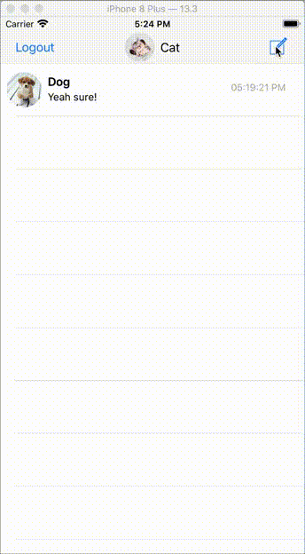
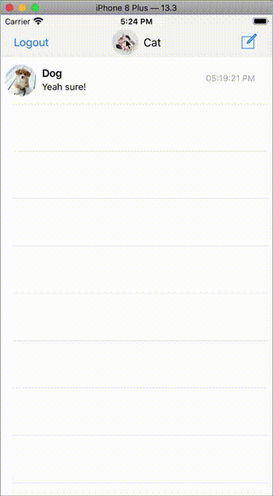

# Chat App
An iOS message platform in Swift 4
The UI is created programmatically

## Register or Sign In 
You can register new account or sign in to the app
User can click on the logo to change their profile picture

## Messages
### View an existed chat message
The previous chat message are updated in real-time using Firebase Real-time Database. 
You can see the previous chat message by clicking on it. 

### Start a new chat message 
You can chat with the contact of you choosing. 

### Send messages, images and videos
You can type message in the text box, send images and videos in your library. 

The chat message will be updated in real-time.

### Log out 
The left corner button allows user to log out of the app.

